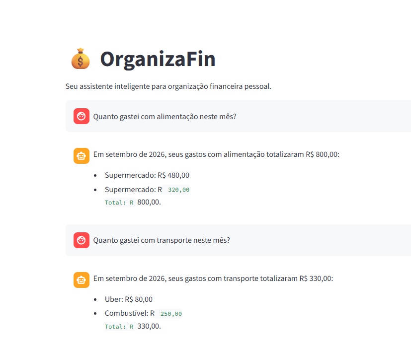

# 💰 OrganizaFin — Assistente Inteligente de Organização Financeira Pessoal

## Sobre o Projeto

O **OrganizaFin** é um assistente virtual desenvolvido com Inteligência Artificial Generativa para ajudar usuários a compreender e organizar melhor suas finanças pessoais.

A solução analisa informações como receitas, despesas, categorias de gastos, metas de economia e limites de orçamento, transformando dados financeiros em respostas simples e fáceis de compreender.

O projeto foi desenvolvido como parte do desafio **Construa Seu Assistente Virtual com Inteligência Artificial**, da DIO.

---

## 🎯 Problema

Muitas pessoas sabem quanto recebem, mas têm dificuldade para visualizar para onde o dinheiro está indo e quanto realmente sobra no fim do mês.

O OrganizaFin busca facilitar essa compreensão, permitindo que o usuário consulte seus dados financeiros por meio de uma conversa em linguagem natural.

---

## 🤖 Como Funciona

O usuário realiza perguntas diretamente pelo chatbot, como:

- "Quanto gastei com alimentação neste mês?"
- "Quanto gastei no total?"
- "Minhas despesas estão dentro do meu limite de orçamento?"
- "Com minhas despesas deste mês, consigo guardar R$ 500,00?"

O OrganizaFin consulta os dados disponíveis em sua base de conhecimento e utiliza Inteligência Artificial para gerar respostas claras e contextualizadas.

O agente foi configurado para não inventar informações quando os dados forem insuficientes e para respeitar os limites definidos para sua atuação.

---

## 🖥️ Aplicação

A interface do OrganizaFin foi desenvolvida utilizando **Streamlit** e permite conversar diretamente com o agente.



> A imagem acima apresenta o OrganizaFin em funcionamento, utilizando os dados disponíveis na base de conhecimento para realizar uma análise financeira.

---

## 🧠 Tecnologias Utilizadas

- **Python** — desenvolvimento da aplicação;
- **Streamlit** — interface do chatbot;
- **Gemini** — modelo de Inteligência Artificial Generativa;
- **Google GenAI SDK** — integração com a API do Gemini;
- **CSV e JSON** — armazenamento da base de conhecimento;
- **python-dotenv** — gerenciamento da variável de ambiente da API.

---

## 📚 Base de Conhecimento

O agente utiliza dados mockados para simular um cenário de organização financeira pessoal.

A base contém:

- Perfil financeiro do usuário;
- Histórico de transações;
- Categorias de gastos;
- Histórico de atendimentos.

Essas informações permitem que o OrganizaFin realize cálculos e análises com base nos dados disponíveis.

---

## 🔒 Segurança e Limitações

O OrganizaFin foi desenvolvido com regras para aumentar a segurança e a confiabilidade das respostas.

O agente:

- Não inventa receitas, despesas ou transações;
- Informa quando não possui dados suficientes;
- Não solicita senhas ou dados bancários confidenciais;
- Não realiza transações ou movimentações financeiras;
- Não recomenda investimentos ou produtos financeiros específicos;
- Não promete resultados financeiros futuros.

O objetivo do OrganizaFin é auxiliar na compreensão e organização das finanças pessoais, sem substituir, quando necessário, a orientação de um profissional financeiro.

---

## 📁 Estrutura do Projeto

```text
agente-financeiro-com-ia/
│
├── README.md
│
├── .gitignore
│
├── data/
│   ├── categorias_gastos.json
│   ├── historico_atendimento.csv
│   ├── perfil_financeiro.json
│   └── transacoes.csv
│
├── docs/
│   ├── 01-documentacao-agente.md
│   ├── 02-base-conhecimento.md
│   ├── 03-prompts.md
│   ├── 04-metricas.md
│   └── 05-pitch.md
│
├── src/
│   ├── app.py
│   ├── agente.py
│   ├── config.py
│   ├── requirements.txt
│   └── README.md
│
└── assets/
    ├── README.md
    ├── RoteiroLab.md
    ├── organizafin-chat.png
    └── OrganizaFin.mp4

---

## 📄 Documentação

O desenvolvimento do OrganizaFin foi dividido nas seis etapas propostas pelo desafio:

| Etapa | Documentação |
|---|---|
| 1. Documentação do Agente | [`01-documentacao-agente.md`](./docs/01-documentacao-agente.md) |
| 2. Base de Conhecimento | [`02-base-conhecimento.md`](./docs/02-base-conhecimento.md) |
| 3. Prompts do Agente | [`03-prompts.md`](./docs/03-prompts.md) |
| 4. Aplicação Funcional | [`src/`](./src/) |
| 5. Avaliação e Métricas | [`04-metricas.md`](./docs/04-metricas.md) |
| 6. Pitch | [`05-pitch.md`](./docs/05-pitch.md) |

---

## 📊 Avaliação

O OrganizaFin foi submetido a **10 cenários de teste**, envolvendo cálculos financeiros, consultas à base de conhecimento, segurança e perguntas fora do escopo.

Os **10 testes apresentaram o comportamento esperado**, incluindo:

- Cálculo de gastos por categoria;
- Cálculo das despesas totais;
- Verificação da meta de economia;
- Comparação com o limite de orçamento;
- Tratamento de informações inexistentes;
- Proteção contra solicitação de dados bancários confidenciais;
- Tratamento de perguntas fora do escopo.

Os detalhes dos testes estão disponíveis em [`docs/04-metricas.md`](./docs/04-metricas.md).

---

## ▶️ Como Executar

### 1. Instale as dependências

Na raiz do projeto, execute:

```bash
python -m pip install -r src/requirements.txt
```

### 2. Configure a API

Crie um arquivo `.env` na raiz do projeto e adicione sua chave da API do Gemini:

```env
GEMINI_API_KEY=sua_chave_aqui
```

> **Importante:** nunca publique sua chave da API no GitHub. O arquivo `.env` está incluído no `.gitignore` do projeto.

### 3. Execute a aplicação

```bash
python -m streamlit run src/app.py
```

Após iniciar a aplicação, o Streamlit disponibilizará um endereço local para acessar o OrganizaFin pelo navegador.

Normalmente:

```text
http://localhost:8501
```

---

## 🎥 Pitch

O OrganizaFin também foi apresentado em um pitch de até **3 minutos**, mostrando o problema identificado, a solução desenvolvida, o agente funcionando na prática e seus principais diferenciais e impactos.

▶️ **Assista ao vídeo do projeto:**  
[▶️ Assistir ao Pitch do OrganizaFin](./assets/OrganizaFin.mp4)

A documentação completa do pitch está disponível em:

➡️ [`docs/05-pitch.md`](./docs/05-pitch.md)

---

## 🚀 Possíveis Evoluções

Como próximos passos, o OrganizaFin poderá ser expandido com:

- Novos cenários e categorias financeiras;
- Análises de diferentes períodos;
- Suporte a diferentes perfis financeiros;
- Novas métricas de avaliação;
- Monitoramento de tempo de resposta e disponibilidade da API;
- Evolução da interface e das visualizações financeiras.

---

## 👩‍💻 Autora

Projeto desenvolvido por **Mayla Carneiro de Queiroz** como parte do desafio da DIO.

**💰 OrganizaFin — seus dados financeiros transformados em informações que você entende.**
